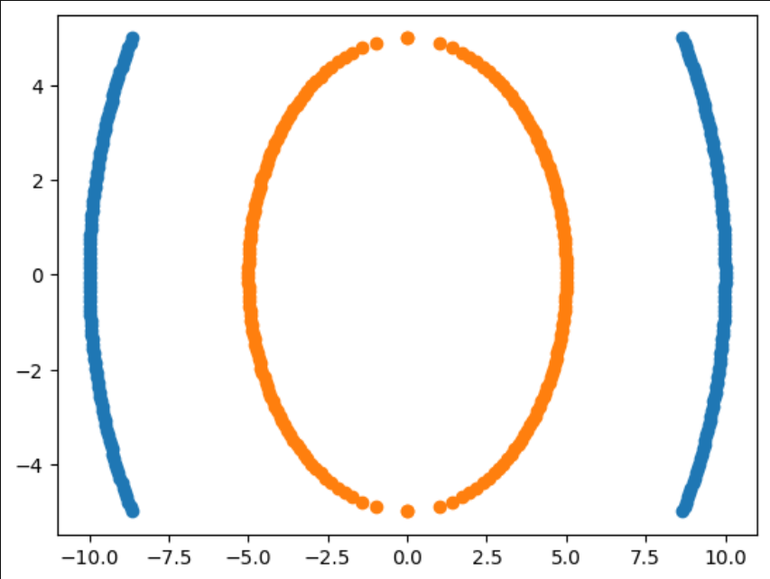
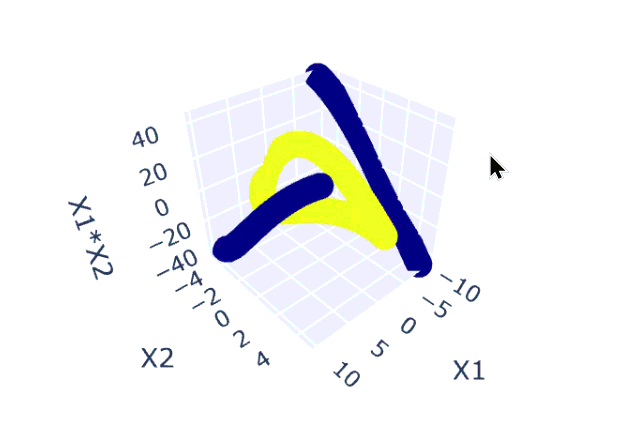
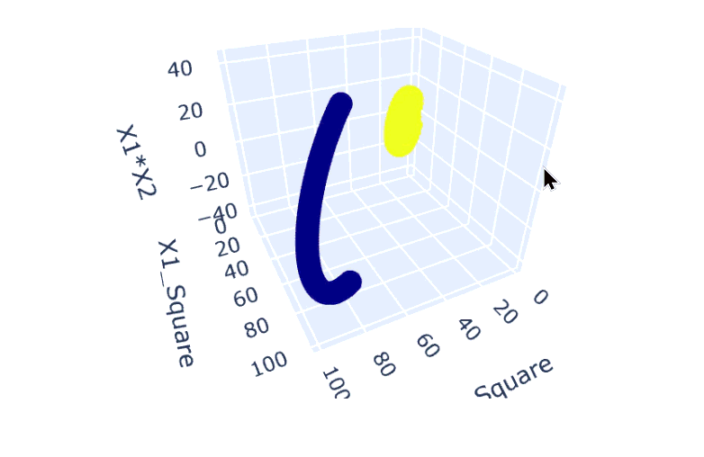

# Support Vector Machine (SVM) 
Complete Study Repository

A comprehensive collection of Jupyter notebooks covering SVM fundamentals, kernel methods, and Support Vector Regression (SVR) with hyperparameter tuning.

---

## 📁 Repository Structure

```
SVM/
├── images/
│   ├── part1.png
│   ├── part2.gif
│   └── part3.gif
├── .gitignore
├── SVM_Basics.ipynb
├── SVM_Kernal_Implementation.ipynb
└── Support_Vector_Regression_Implementation.ipynb
```

---

## 📓 Notebook Descriptions

### 1. `SVM_Basics.ipynb` — SVM Classification Fundamentals

Introduces SVM for binary classification using synthetic data and explores all four major kernel types.

**Key Steps:**
- Generates a synthetic binary classification dataset (1000 samples, 2 features) using `sklearn.datasets.make_classification`
- Visualizes the dataset with a scatter plot using Seaborn
- Splits data into 75% training / 25% test sets
- Trains and evaluates SVM classifiers with four kernels:

| Kernel     | Test Accuracy |
|------------|---------------|
| Linear     | 86%           |
| RBF        | 87%           |
| Polynomial | 85%           |
| Sigmoid    | 82%           |

- Performs **Hyperparameter Tuning** with `GridSearchCV` over `C` ∈ [0.1, 1, 10, 100, 1000] and `gamma` ∈ [1, 0.1, 0.01, 0.001, 0.0001] using 5-fold cross-validation
- Best parameters found: `{'C': 1, 'gamma': 1, 'kernel': 'rbf'}` → **88% accuracy**

**Libraries Used:** `pandas`, `numpy`, `seaborn`, `matplotlib`, `sklearn`

---

### 2. `SVM_Kernal_Implementation.ipynb` — In-Depth Kernel Intuition

Provides a geometric/intuitive understanding of how SVM kernels transform non-linearly separable data into linearly separable feature spaces.

<p align="center">
  
  &nbsp;&nbsp;➡️&nbsp;&nbsp;
  
  &nbsp;&nbsp;➡️&nbsp;&nbsp;
  
</p>
<p align="center">
  <sub>2D concentric circles &nbsp;&nbsp;&nbsp;&nbsp;&nbsp;&nbsp;&nbsp;&nbsp;&nbsp;&nbsp;&nbsp;&nbsp;&nbsp;&nbsp;&nbsp;&nbsp;&nbsp;&nbsp;&nbsp;&nbsp;&nbsp;&nbsp;&nbsp;&nbsp; Polynomial feature mapping (3D) &nbsp;&nbsp;&nbsp;&nbsp;&nbsp;&nbsp;&nbsp;&nbsp;&nbsp;&nbsp;&nbsp;&nbsp;&nbsp;&nbsp;&nbsp;&nbsp;&nbsp;&nbsp;&nbsp;&nbsp;&nbsp;&nbsp;&nbsp;&nbsp; Linearly separable in higher dimension</sub>
</p>

**Key Steps:**
- Creates a circular (concentric rings) dataset manually using NumPy — two classes arranged as concentric circles with radii 5 and 10
- Visualizes the 2D non-linear structure with `matplotlib` *(part1.png)*
- Demonstrates the **Polynomial Kernel trick** by engineering features: `X1²`, `X2²`, and `X1*X2`
- Uses **Plotly Express** for 3D scatter plots to show how the data becomes separable in the higher-dimensional polynomial feature space *(part2.gif, part3.gif)*
- Trains SVM classifiers with all four kernels on the transformed dataset:

| Kernel     | Accuracy |
|------------|----------|
| Linear     | 100%     |
| Polynomial | 100%     |
| RBF        | 100%     |
| Sigmoid    | 100%     |

All kernels achieve perfect classification, demonstrating the power of the kernel trick on geometrically structured data.

**Libraries Used:** `numpy`, `matplotlib`, `pandas`, `plotly.express`, `sklearn`

---

### 3. `Support_Vector_Regression_Implementation.ipynb` — SVR on Real-World Data

Applies Support Vector Regression to predict restaurant bill totals using the Seaborn **Tips** dataset.

**Dataset:** `tips` (244 records, 7 columns)
- **Target:** `total_bill` (continuous)
- **Features:** `tip`, `sex`, `smoker`, `day`, `time`, `size`

**Key Steps:**
1. **Data Exploration** — inspects dataset shape, data types, and value counts for categorical columns
2. **Feature Engineering:**
   - Label encodes binary columns: `sex`, `smoker`, `time`
   - One-Hot encodes `day` (4 categories) using `ColumnTransformer` with `drop='first'` to avoid multicollinearity
3. **Baseline SVR** (default RBF kernel):
   - R² Score: **0.460**
   - Mean Absolute Error: **4.149**
4. **Hyperparameter Tuning** with `GridSearchCV`:
   - Grid: `C` ∈ [0.1, 1, 10, 100, 1000], `gamma` ∈ [1, 0.1, 0.01, 0.001, 0.0001], kernel = `rbf`
   - Best parameters: `{'C': 1000, 'gamma': 0.0001, 'kernel': 'rbf'}`
5. **Tuned SVR results:**
   - R² Score: **0.508** (↑ improvement)
   - Mean Absolute Error: **3.869** (↓ improvement)

**Libraries Used:** `seaborn`, `sklearn` (`SVR`, `GridSearchCV`, `LabelEncoder`, `OneHotEncoder`, `ColumnTransformer`)

---

## ⚙️ Requirements

```bash
pip install numpy pandas matplotlib seaborn scikit-learn plotly
```

**Python Version:** 3.10+

---

## 🔑 Key Concepts Covered

| Concept | Description |
|---|---|
| **SVM Classification** | Finds the optimal hyperplane maximizing margin between classes |
| **Kernel Trick** | Maps data to higher dimensions without explicit transformation |
| **Linear Kernel** | Best for linearly separable data |
| **RBF Kernel** | General-purpose kernel; good for non-linear boundaries |
| **Polynomial Kernel** | Captures polynomial relationships between features |
| **Sigmoid Kernel** | Mimics neural network activation; less commonly used |
| **SVR** | SVM adapted for regression — fits data within an epsilon-tube |
| **GridSearchCV** | Exhaustive hyperparameter search with cross-validation |
| **Label Encoding** | Converts binary categorical features to 0/1 |
| **One-Hot Encoding** | Converts multi-class categories to binary columns |

---

## 📊 Results Summary

| Notebook | Task | Best Accuracy / R² |
|---|---|---|
| SVM Basics | Binary Classification | 88% (after tuning) |
| Kernel Implementation | Circular Data Classification | 100% (all kernels) |
| SVR Implementation | Regression (Tips Dataset) | R² = 0.508 (after tuning) |

---

## 🚀 Getting Started

1. Clone the repository
2. Install dependencies
3. Launch Jupyter:
   ```bash
   jupyter notebook
   ```
4. Run notebooks in order for a progressive learning experience:
   - Start with `SVM_Basics.ipynb`
   - Continue to `SVM_Kernal_Implementation.ipynb`
   - Finish with `Support_Vector_Regression_Implementation.ipynb`

---

## 📌 Notes

- All notebooks use `random_state` for reproducibility where applicable
- The kernel intuition notebook uses a synthetic geometric dataset (concentric circles) specifically designed to illustrate the kernel trick visually
- SVR performance on the Tips dataset is moderate (R² ≈ 0.51), which is expected given the small dataset size and inherent noise in tipping behavior

---

## 🙋 About This Repository

> I'm currently on my machine learning journey and actively learning new concepts every day. This repository is a reflection of my progress — I build, experiment, and document as I go. Every notebook here represents something I've genuinely tried to understand, not just run. 🚀

---

## 🙏 Acknowledgements

A huge thanks to **[Krish Naik Sir](https://github.com/krishnaik06)** whose Udemy course has been an incredible resource throughout this learning journey. The clarity and depth with which he explains machine learning concepts — including SVMs — made it much easier to understand the theory and apply it practically.
> *"Learning is a journey, not a destination."*
